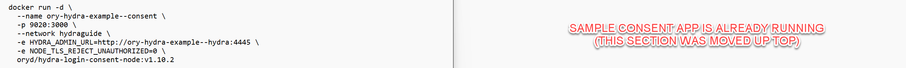
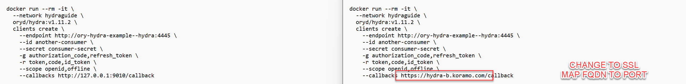

# Run your own OAuth2 Server

## Comparison of Changes to Ory Hydra Document

The Ory document, titled ["Run your own OAuth2 Server" (located here)](https://www.ory.sh/run-oauth2-server-open-source-api-security/) is rather confusing.  The original document makes use of direct port references without ever discussing any real-world scenario.  So, while the reader is able to see Ory Hydra do _something_ there is very little explaination as to what it does, why it works, or how each snippet would apply in a production environment.  The sections below provide a side-by-side graphical comparison between the original Ory document (left) and the version provided in this repository.  Furthermore, NGINX has been added to handle name resolution, SSL certificates, and the use of proper names instead of ports.

## NGINX, SSL, and Echo Server

For this solution to work, we need a mechanism for hiding the Ory ports behind a fully-qualified machine name.  The first section of my version tackles the installation of NGINX as well as installing a simple Echo Server.  This Echo Server is not needed in production.  It's added here so you have something to test against should Ory or NGINX not work properly.

## Network & Database

No real difference here.  The only thing I added was some static test values for the two environment variables Ory suggested you use.

## Example Consent Application

The original docs have you setup an example Consent applicaiton later on in the process.  I suggest you move it up further to the top, and add it first, so we have a simple Ory service to call upon, test name resolution, and start mapping the ports.  Not a big change.

## Primary Hydra Instance & Client Credentials Flow

One of the oddities not discussed in the original document is that Ory actually uses _two_ separate service instances of the Hydra product.  In this next section they stand up the primary Hydra instance and blas through the Client Credentials flow.  What is important to point out in this section is the actual public name of both Hydra and the Consent application; something that was not very clear in the original document.

## (Already Completed) Example Consent Application

We already tackled the install of the example Consent application a few steps ago.  While it does make sense that they added it here, after the intial Client Credentials flow example was completed, I still feel it was better to set it up early on so we could resolve all of the NGINX port mappings up front.  This is why you don't see any code on the right side of the screen below.

## Prepare for the Second Hydra Instance

A temporary instance of Hydra is used to insert a new client identifier into the database.  This is where name resolution is important as that last line in the Docker syntax needs to create a callback to the _second_ Hydra instance we are about to stand up.

## Surprise!  Hydra Instance #2

For me, the use of a _second_ Hydra instance was most upsetting aspect of the original document.  The author did not discuss why a second instance was needed.  No mention of how this relates to a real-world OAuth scenario appears in the document.  And, there is such an overuse of port numbers and generic names that the notion of a second instance almost vanishes under the covers.

Another annoying aspect was the document instructs the user to blindly launch this new instance as an interactive container which blocks the current terminal session.  Granted, the document was clearly written for the reader to follow along on their workstation, however that's the problem; it only ever disucsses this one singular instance of _watching_ Hydra magically run, do _something_ and then disappear.

Finally, even _if_ you were to run this next section as an interactive container, the user is presented with bogus information.  In our example we used fully-qualified machine names for each endpoint.  And, those names were supplied to this interactive container as environment variables.  However, Hydra completely _ignores_ those machine names when outputting the helper text at the bottom of the reader's terminal.  So, unless you blindly use `127.0.0.1` for every address in _your_ syntax, the helper text displayed is always wrong.  The text you see on the comparison, below, was replaced by me just in case someone fails to read _this_ text.

Anyway, the supplied version of the code launches the second Hydra instance in daemon mode so the reader has their command prompt back.  Oh, and the incorrect helper text is never displayed.

asdf
